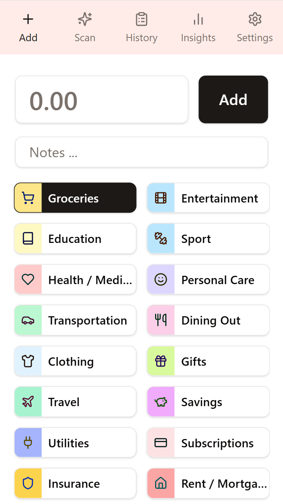
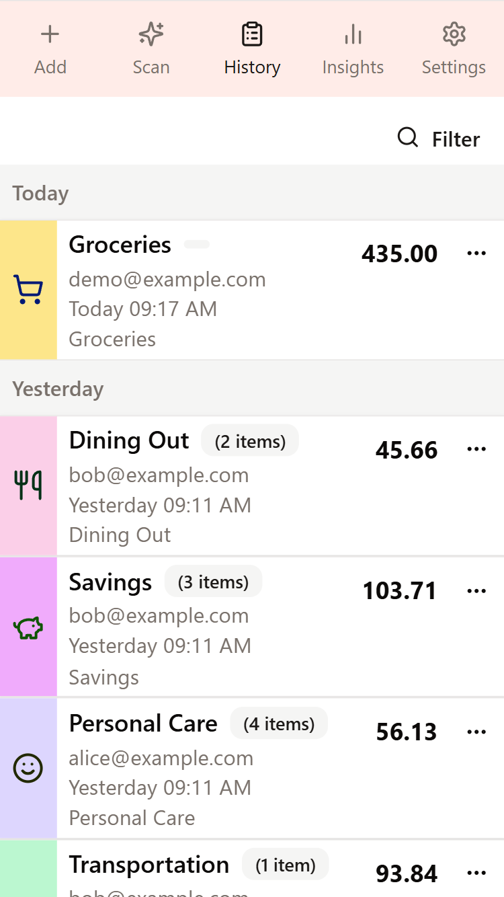
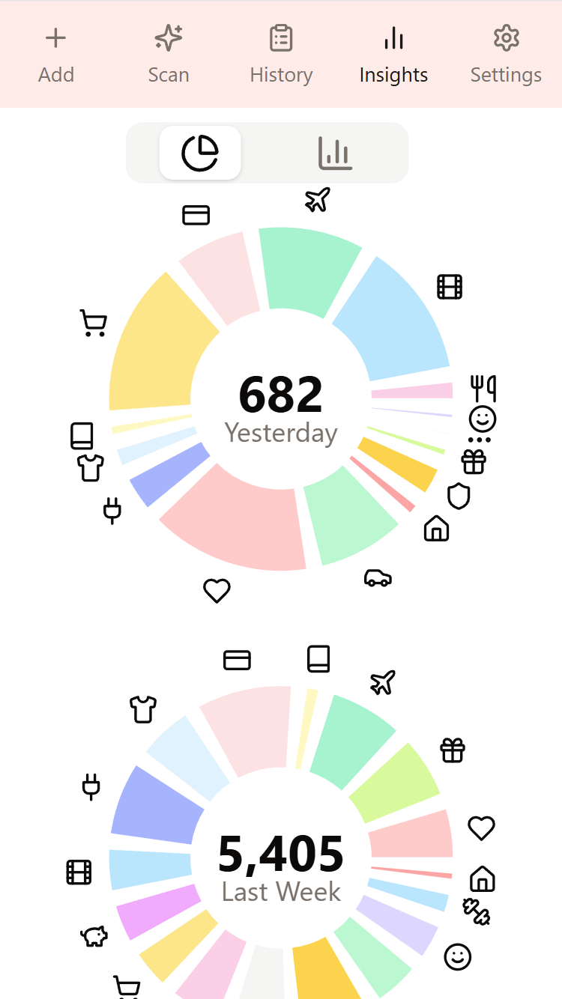

# Ledger Eleven

[](./LICENSE)

LedgerEleven is a simple, mobile-first personal expense tracker designed for quick and easy entry on the go. It helps you visualize spending trends, import/export data for analysis, and leverages AI for a smarter experience.

## Key Features

*   **Mobile-First Design:** Optimized for a seamless experience on your smartphone.
*   **AI-Powered Insights:** Get a smarter understanding of your spending habits.
*   **Data Portability:** Easily import and export your data.
*   **Self-Hostable:** Run it on your own infrastructure using Docker.
*   **Secure:** Your data is your own.

## Screenshots

<table>
  <tr>
    <td></td>
    <td></td>
    <td></td>
  </tr>
</table>

## Live Application

The application is publicly available at: **[https://ledgereleven.com/](https://ledgereleven.com/)**

## Technology Stack

*   **Backend:** C#, .NET 9, ASP.NET Core
*   **Frontend:** React, TypeScript, Vite
*   **Database:** SQLite
*   **Testing:** Playwright for end-to-end tests, xUnit for unit tests
*   **Containerization:** Docker

## Development

To get a local copy up and running, follow these simple steps.

### Running the Application Locally

(_Requires: .NET 9.0 SDK and node.js installed._)

1.  **Start the backend:**
    ```bash
    cd ./src/ledger11.web
    dotnet run
    ```

2.  **Start the frontend (in a new terminal):**
    ```bash
    cd ./src/ledger11.client
    npm run dev
    ```

The application will be available at `http://localhost:5173`.

### Running in a Container

(_Requires: Docker or Docker for Desktop installed._)

```bash
cd ./.devops/build
docker-compose up --build
```

The application will be available at `http://localhost:8080`.

### Running Tests

#### Locally

**Backend Tests:**
```bash
cd src
dotnet test
```

**Frontend Tests:**

First, start the backend. Then, in a new terminal:
```bash
cd ./src/ledger11.webtests
npx playwright test
```

#### In a Container

**Backend Tests:**
```bash
cd ./.devops/test/backend
docker-compose run --build --rm app-test
```

**Frontend Tests:**
```bash
cd ./.devops/test/web
docker-compose run --build --rm test
```

## Documentation

For more detailed instructions, troubleshooting, and a full list of useful commands, please refer to the following documents:

*   **[Getting Started](./docs/getting-started/index.md)**: Detailed setup and development instructions.
*   **[About](./docs/welcome.md)**: More about the app, architecture, technology and design choices.

## Contributing

Contributions are what make the open source community such an amazing place to learn, inspire, and create. Any contributions you make are **greatly appreciated**.

Please read our [**Contributing Guide**](./CONTRIBUTING.md) for details on our code of conduct, and the process for submitting pull requests to us.


