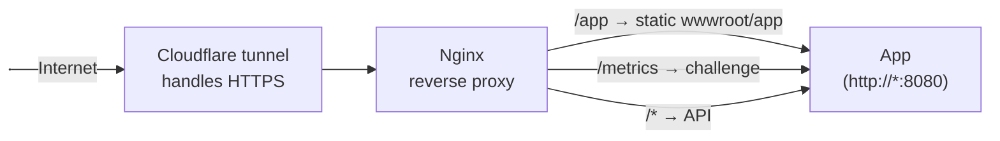

# Hosting Locally

This document describes how to host the LedgerEleven application locally, from a simple proof of concept to a more production-ready setup.

## Building the Application

The `.devops/build` directory contains the core components for building the application into a container image.

*   **`Dockerfile.ledger-eleven-app`**: This Dockerfile compiles the .NET backend and the React frontend, packaging them into a single, self-contained image.
*   **`docker-compose.yaml`**: This file provides a basic example of how to configure and run the application image in a simple development environment, exposing the necessary ports for local access.

To build and run the application from this directory, navigate to `.devops/build` and run:

```bash
cd .devops/build
docker-compose up --build -d
```

This command will build the Docker image from the `Dockerfile.ledger-eleven-app` and start the container in detached mode.

## Staging and Proof of Concept

To host the application for anything more than a quick local test, you will typically need a public domain name and a TLS certificate to enable secure HTTPS access.

One straightforward way to achieve this is by using a [Cloudflare Tunnel](https://www.cloudflare.com/products/tunnel/). A Cloudflare Tunnel creates a secure, outbound-only connection from your local server to the Cloudflare network. This allows you to expose your local application to the internet through a public hostname without opening any ports on your firewall.

The `.devops/stage` directory includes an example `docker-compose.yaml` that demonstrates this setup. It uses the same `Dockerfile.ledger-eleven-app` from the `build` directory to build the application and then starts it behind a Cloudflare Tunnel service.

To run the staging environment:

1.  Navigate to the `.devops/stage` directory.
2.  Create a `.env` file from the template:
    ```bash
    cp .env.template .env
    ```
3.  Edit the `.env` file and add your Cloudflare Tunnel token to the `APP_TUNNEL_TOKEN` variable.
4.  Start the services:
    ```bash
    docker-compose up -d
    ```

## Production-Ready Environment

For a more robust, production-ready environment, we recommend adding a reverse proxy, such as Nginx, as an additional layer between the Cloudflare Tunnel and the application.

In this setup:
1.  **Cloudflare Tunnel** acts as the first line of defense, protecting your network from DDoS attacks and other malicious traffic.
2.  **Nginx Reverse Proxy** receives the traffic from the tunnel and intelligently routes it to the appropriate service.

A key benefit of this approach is optimizing how the application's static files are served. The React client application is compiled and placed into the `wwwroot/app` folder within the `ledger11.web` project. While the .NET web server is perfectly capable of serving these files, a reverse proxy like Nginx is far more efficient at handling requests for static content.

Therefore, the recommended configuration is to have the Nginx reverse proxy serve the static React app directly from the filesystem, while forwarding all API requests (e.g., to `/api/...`) to the backend .NET application. This separation of concerns improves performance and scalability.

### Production Architecture Diagram



In this diagram:
- **Cloudflare Tunnel**: Exposes your service to the internet, handling HTTPS termination and providing protection against attacks.
- **Nginx Reverse Proxy**: Listens for plain HTTP traffic from the tunnel. It serves static files (the React app) directly and forwards all API requests (under `/api/`) to the LedgerEleven application container. It can also be configured to add extra security, like authentication challenges for specific endpoints (e.g., `/metrics`).
- **LedgerEleven App**: The backend application, which only needs to be exposed on HTTP within the Docker network.
